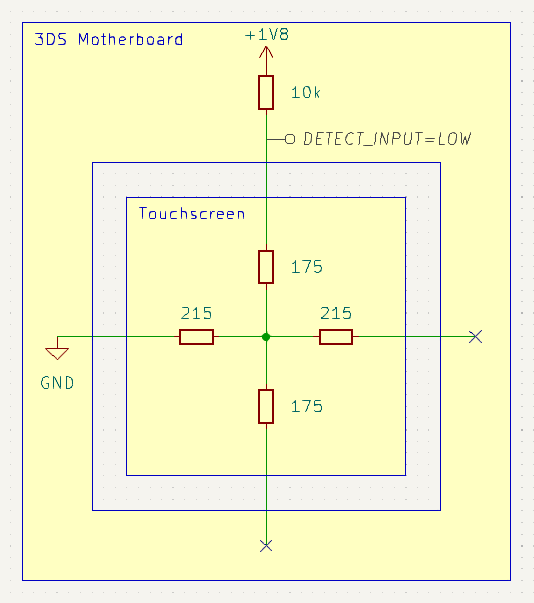
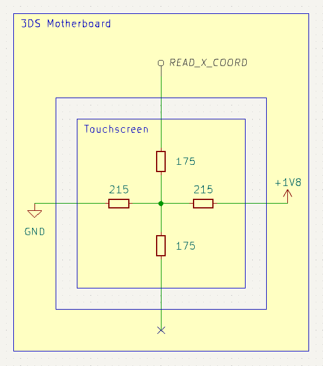
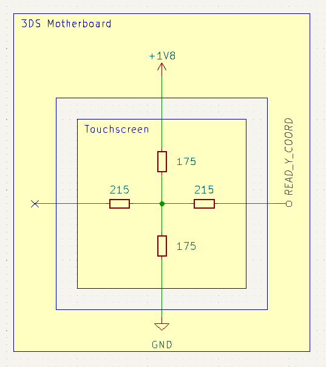
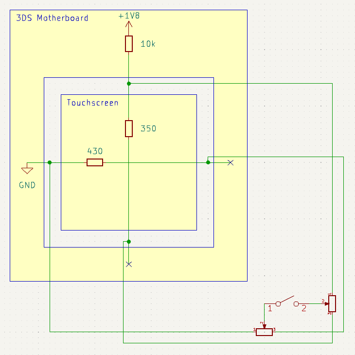
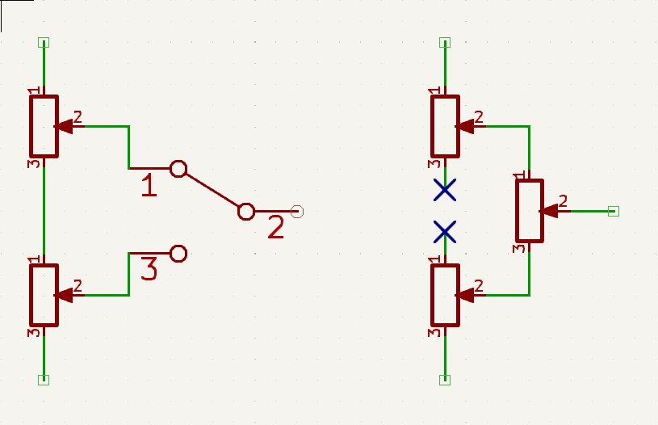
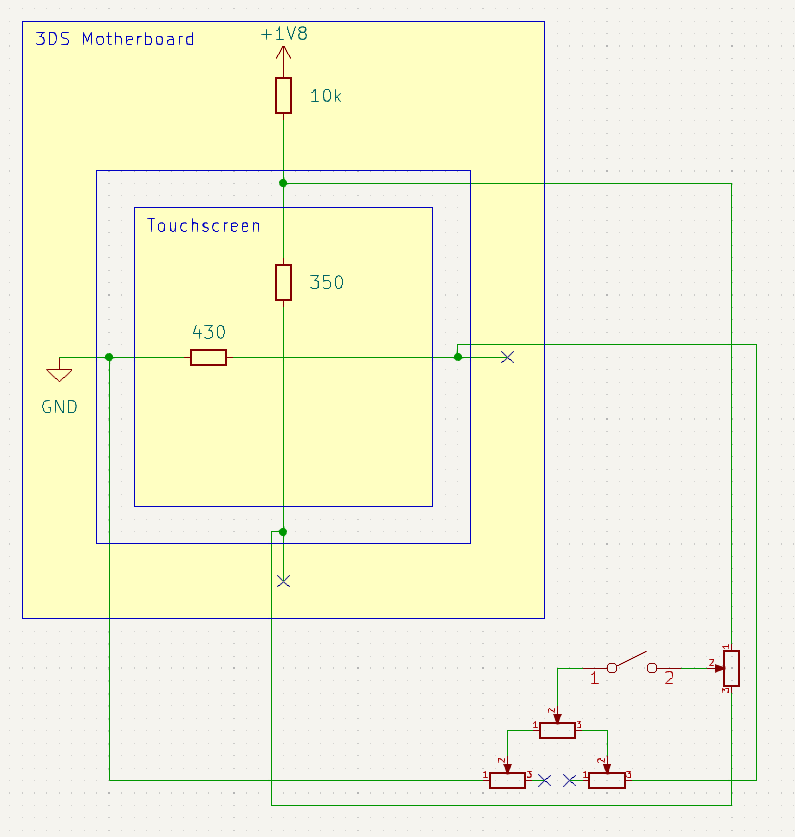
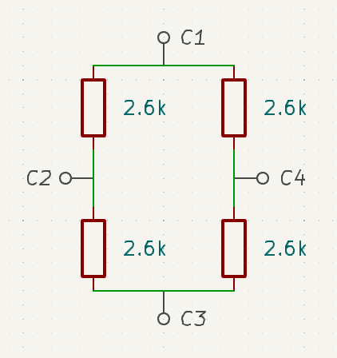
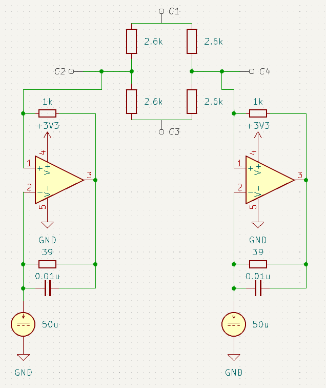
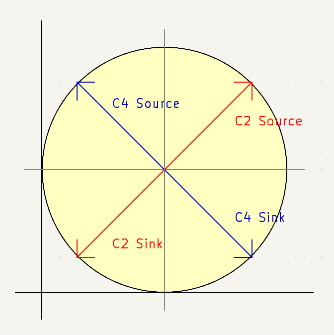

## ボタン

押下されることでパッドが導通する一般的な構造で、アクティブローです。

## スライドパッド

## タッチスクリーン

画素数は320x240で、抵抗膜方式のタッチパネルを使用しています。全抵抗値はX軸430Ω、Y軸350Ω（実測値）です。抵抗膜方式タッチパネルでは以下の手順で入力座標を検知します[^1]。ポーリングレートは240Hz（4.2ms）程度です。プルアップ抵抗はMCUに内蔵されていると考えられ、10kΩはシミュレーション用の値であり正確な値は不明です[^2]。

[^1]: [4-Wire and 8-Wire Resistive Touch-Screen Controller Using the MSP430](https://web.archive.org/web/20140630073208/http://www.ti.com/lit/an/slaa384a/slaa384a.pdf)
[^2]: ～10kΩ程度ではあるようです。

<table>
<tr>
<td>

Y軸の一方の端をプルアップ抵抗ありデジタル入力`DETECT_INPUT`、他方をHi-Z、X軸の一方の端をGND（`LOW`）他方をHi-Zに設定します。`DETECT_INPUT`は`HIGH`となります。

</td>
<td>

</td>
</tr>
<tr>
<td>

入力されると両軸が接触します。2軸の全抵抗値の和はプルアップ抵抗の値より十分に小さいため、`DETECT_INPUT`は`LOW`に変化します。画像は画面の中央を押下した例です。

</td>
<td>

</td>
</tr>
<tr>
<td>

X軸の一方の端を1v8（`HIGH`）他方をGNDに設定し、アナログ入力`READ_X_COORD`からX座標を検知します。画像の例では`READ_X_COORD`は0.9Vとなり、`0.9 / 1.8 = 0.5`よりX軸方向の中央を入力していることがわかります。

</td>
<td>

</td>
</tr>
<tr>
<td>

Y軸の一方の端を1v8、他方をGNDに設定し、アナログ入力`READ_Y_COORD`からY座標を検知します。

</td>
<td>

</td>
</tr>
</table>

2基のデジタルポテンショメータと単極・単投（SPST）のCMOSアナログスイッチを使って疑似タッチパネル回路を構築することで、3DSに「タッチスクリーンを操作している」と認識させることができます。

下画面のX軸には320段階を超える分解能のデジタルポテンショメータが望ましいです。また、デジタルポテンショメータの全抵抗値とCMOSアナログスイッチのオン抵抗の和は、プルアップ抵抗の値に対して十分に小さい必要があります。実験の結果、合計3KΩ程度であれば問題ない（`DETECT_INPUT`が`LOW`と認識される）ことがわかっています。2024年3月時点で販売されているラインナップには、この要件を満たすデジタルポテンショメータはありません。

| 品番                                                          | メーカー       | 機能                        |
| ------------------------------------------------------------- | -------------- | --------------------------- |
| [AD8403ARUZ1](https://www.analog.com/en/products/ad8403.html) | Analog Devices | 全抵抗値1kΩ、4ch、256段階   |
| [MAX5494](https://www.analog.com/en/products/max5494.html)    | Analog Devices | 全抵抗値10kΩ、2ch、1024段階 |

そこで、1kΩのデジタルポテンショメータを2基あるいは3基連動させて2倍の分解能を得ます[^2]。

[^2]: 『[複数のデバイスによるデジタル・ポテンショメータの分解能の向上](https://www.analog.com/media/jp/technical-documentation/application-notes/an-582_jp.pdf)』（翻訳元：[AN-582 Resolution Enhancements of Digital Potentiometers with Multiple Devices](https://www.analog.com/media/en/technical-documentation/application-notes/an-582.pdf)）

資料では①②の方法が紹介されています。①ではスイッチの切り替えによって抵抗値の変化が非線形になり、中央付近を入力できませんでした。また②ではX軸の右端付近を入力することができませんでした。

そこで③の方法を考えます。`0 <= D && D <= 255`では上下のポテンショメータを0（上端）に固定し右のポテンショメータをこの値に設定します。`256 <= D && D <= 510`では右のポテンショメータは255（下端）に固定し上下のポテンショメータを`D - 255`に設定します。この回路は全体として、全抵抗値2kΩ、511段階のポテンショメータとして振る舞います。

加えて、AD8403は5Vで駆動することで、3Vで駆動させる場合と比較してワイパー抵抗値を4分の1程度に抑えることができます。以上の対策を施し、タッチスクリーンのほぼ全範囲を入力することが可能になります。

## Cスティック

3DSのCスティックは、ひずみゲージを使用しています[^4]。基本的な考え方はスライドパッドのポテンショメータと同様ですが、微弱な抵抗値の変化を入力に変換する点が異なります。以下では、FPCコネクタ実装面から見て左から順にC1～C4とします。

[^4]: [Pointing stick - Wikipedia](https://en.wikipedia.org/wiki/Pointing_stick)

電流ソース／シンクD/Aコンバータを使用する点もスライドパッドと同じですが、市販のD/Aコンバータの出力電流は過大なので、単電源CMOSオペアンプを使用した増幅回路を構築して電流量を調節します[^5]。(±50 * 39 / 1000)uAのソース／シンクで安定した制御が可能です。

[^5]: 『[電流ソース回路と電流シンク回路の実装と応用](https://www.ti.com/jp/lit/pdf/jaja186)』（翻訳元：[Implementation and Applications of Current Sources and Current Receivers](https://www.ti.com/lit/an/sboa046/sboa046.pdf)）

操作方向は45度回転しています。オペアンプ回路で反転するので、「C2 Source」とある方向へ傾けるにはC2に接続されたD/Aコンバータを電流シンクに設定してください。

