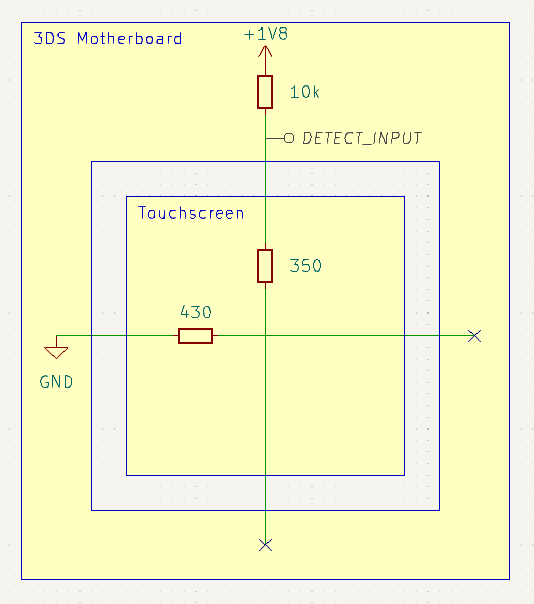
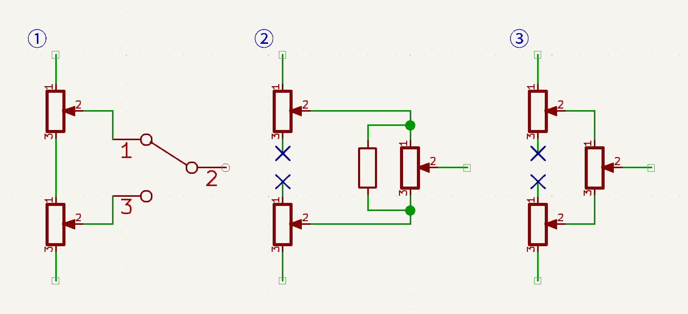

## ボタン

押下されることでパッドが導通する一般的な構造で、アクティブローです。

## スライドパッド

## タッチスクリーン

3DSの下画面は320x240の画素数で、抵抗膜方式のタッチパネルを使用しています。全抵抗値はX軸430Ω、Y軸350Ω（実測値）です。抵抗膜方式タッチパネルでは次の手順で入力座標を検知します[^1]。なおプルアップ抵抗はMCUに内蔵されていると考えられ、10kΩはシミュレーション用の値であり正確な値は不明です。

[^1]: [4-Wire and 8-Wire Resistive Touch-Screen Controller Using the MSP430](https://web.archive.org/web/20140630073208/http://www.ti.com/lit/an/slaa384a/slaa384a.pdf)

<table>
<tr>
<td>

Y軸の一方の端をプルアップ抵抗ありデジタル入力`DETECT_INPUT`、他方をHi-Z、X軸の一方の端をGND（`LOW`）他方をHi-Zに設定します。`DETECT_INPUT`は`HIGH`となります。

</td>
<td>

</td>
</tr>
<tr>
<td>

入力されると両軸が接触します。プルアップ抵抗の値は2軸の全抵抗値の和より十分に大きいため、`DETECT_INPUT`は`LOW`に変化します。画像は画面の中央を押下した例です。

</td>
<td>

</td>
</tr>
<tr>
<td>

X軸の一方の端を1v8（`HIGH`）他方をGNDに設定し、アナログ入力`READ_X_COORD`からX座標を検知します。画像の例では`READ_X_COORD`は0.9Vとなり、`0.9 / 1.8 = 0.5`よりX軸方向の中央を入力していることがわかります。

</td>
<td>

</td>
</tr>
<tr>
<td>

Y軸の一方の端を1v8、他方をGNDに設定し、アナログ入力`READ_Y_COORD`からY座標を検知します。

</td>
<td>

</td>
</tr>
</table>

2基のデジタルポテンショメータと単極・単投（SPST）のCMOSアナログスイッチを使って疑似タッチパネル回路を構築することで、3DSに「タッチスクリーンを操作している」と認識させることができます。

下画面のX軸には320段階を超える分解能のデジタルポテンショメータが望ましいです。また、デジタルポテンショメータの全抵抗値とCMOSアナログスイッチのオン抵抗の和は、プルアップ抵抗の値に対して十分に小さい必要があります。実験の結果、合計3KΩ程度であれば問題ない（`DETECT_INPUT`が`LOW`と認識される）ことがわかっています。2024年3月時点で販売されているラインナップには、この要件を満たすデジタルポテンショメータはありません。

| 品番                                                          | メーカー       | 機能                        |
| ------------------------------------------------------------- | -------------- | --------------------------- |
| [AD8403ARUZ1](https://www.analog.com/en/products/ad8403.html) | Analog Devices | 全抵抗値1kΩ、4ch、256段階   |
| [MAX5494](https://www.analog.com/en/products/max5494.html)    | Analog Devices | 全抵抗値10kΩ、2ch、1024段階 |

1kΩのデジタルポテンショメータを2基あるいは3基連動させて2倍の分解能を得る方法で、ある程度解決できます[^2]。ただし、2基を使用する方法ではワイパーの切り替えによって抵抗値が非線形になり、中央を入力できない問題があります。3基を使用する方法は、現行のQingpiの方式ですが、端子とワイパーの抵抗を無視できなくなりX軸の端を入力できません。

[^2]: [AN-582 Resolution Enhancements of Digital Potentiometers with Multiple Devices](https://www.analog.com/media/en/technical-documentation/application-notes/an-582.pdf)

## Cスティック

3DSのCスティックは、ひずみゲージを使用しています[^3]。基本的な考え方はスライドパッドのポテンショメータと同様ですが、微弱な抵抗値の変化を入力に変換する点が異なります。以下では、FPCコネクタ実装面から見て左から順にC1～C4とします。

[^3]: [Pointing stick - Wikipedia](https://en.wikipedia.org/wiki/Pointing_stick)

電流ソース／シンクD/Aコンバータを使用する点もスライドパッドと同じですが、市販のD/Aコンバータの出力電流は過大なので、単電源CMOSオペアンプを使用した反転増幅回路を構築して電流量を調節します[^4]。(±50 * 39 / 1000)uAのソース／シンクで安定した制御が可能です。

[^4]: 『[電流ソース回路と電流シンク回路の実装と応用](https://www.ti.com/jp/lit/pdf/jaja186)』（翻訳元：[Implementation and Applications of Current Sources and Current Receivers](https://www.ti.com/lit/an/sboa046/sboa046.pdf)）

なお、操作方向は45度回転しています。反転増幅回路を通すので、「C2 Source」とある方向へ傾けるにはC2に接続されたD/Aコンバータを電流シンクに設定してください。

